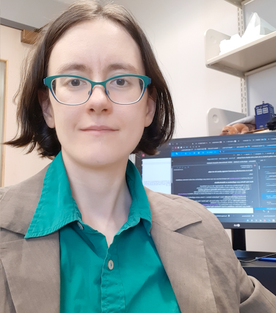
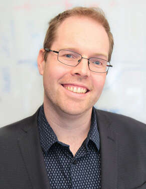
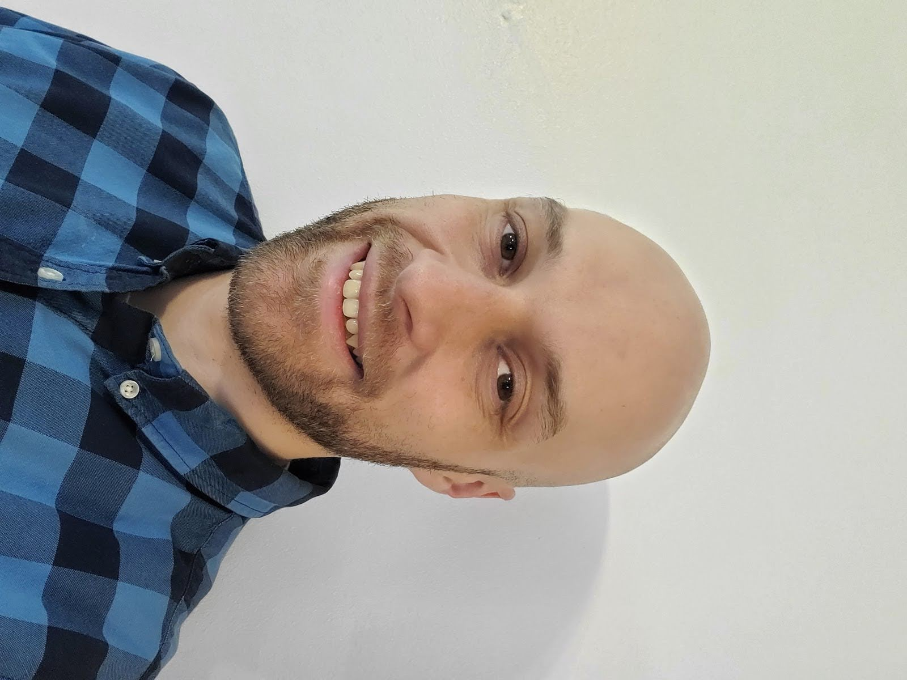
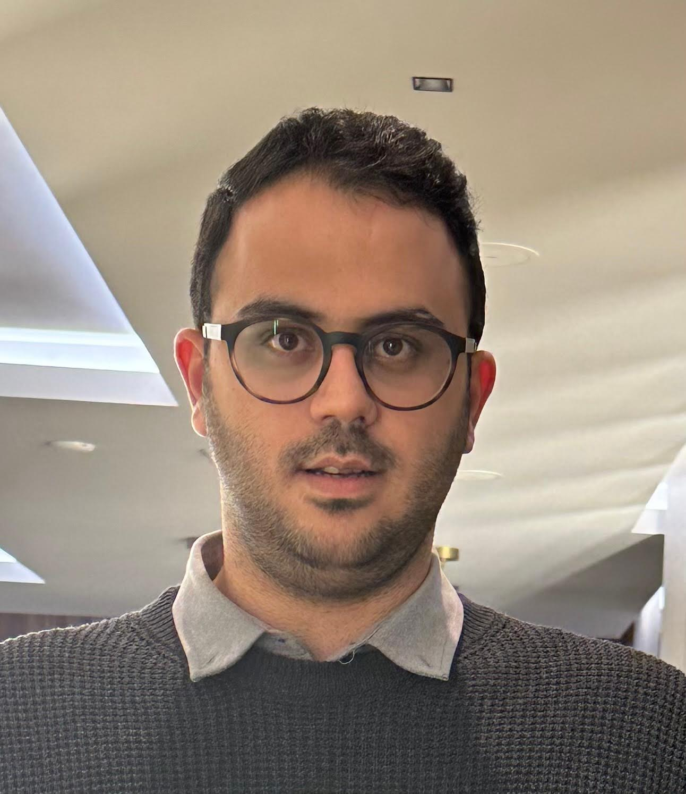

# Meet Your Faculty

#### Tallulah Andrews

>Assistant Professor  
University of Western Ontario

Dr. Tallulah Andrews is an Assistant Professor in the Department of Biochemistry at the University of Western Ontario. Her group focuses on the integration of biological imaging and multiple -omics technologies to understand the structure of diseased tissues. She is a long-term member of the Human Cell Atlas developing computational tools for single-cell RNAseq data while a post-doc at the Wellcome Sanger Institute in Cambridge, UK and analyzing the Healthy Liver atlas in the MacParland group at UHN Research. She holds a PhD from the University of Oxford where she used systems biology approaches to identify biological pathways underlying rare genetic diseases.

#### Trevor Pugh

>Senior Scientist  
Princess Margaret Cancer Centre

Dr. Trevor Pugh is a Senior Investigator and the Director of Genomics at OICR. He leads the OICR Genomics program, which brings together the Princess Margaret Genomics Centre, OICR’s Genome Research Platform, Translational Genomics Laboratory and Genome Sequence Informatics teams under an integrated initiative to support basic, translational and clinical research.
#### Melisa Acun

<!--

>JOB TITLE  
INSTITUTION  
LOCATION
>
> --- CONTACT INFO, IF PROVIDED

BIO GOES HERE-->

#### Nicolas Ho

<!--

>JOB TITLE  
INSTITUTION  
LOCATION
>
> --- CONTACT INFO, IF PROVIDED

BIO GOES HERE-->

#### Kevin Joannou

>PhD Candidate, Immunology  
University of Alberta  
Edmonton, Alberta

Kevin is just finishing his PhD in Immunology at the University of Alberta, in which he uses Single Cell RNA-Sequencing, flow cytometry, and mouse models to study the development of unconventional T cells.

#### Mobin Khoramjoo

>PhD Candidate  
University of Alberta  
Edmonton, Alberta  
https://www.linkedin.com/in/mobin-khoramjoo/

I am a PhD candidate at the University of Alberta with a strong interest in combining computational tools with biological research. My work involves using bioinformatics, multi-omics integration, and machine learning to study complex biological systems and extract meaningful insights from large datasets.
I am especially drawn to the challenge of working with high-dimensional data—developing analysis pipelines, applying statistical models, and exploring ways to make biological findings more interpretable and impactful. 
